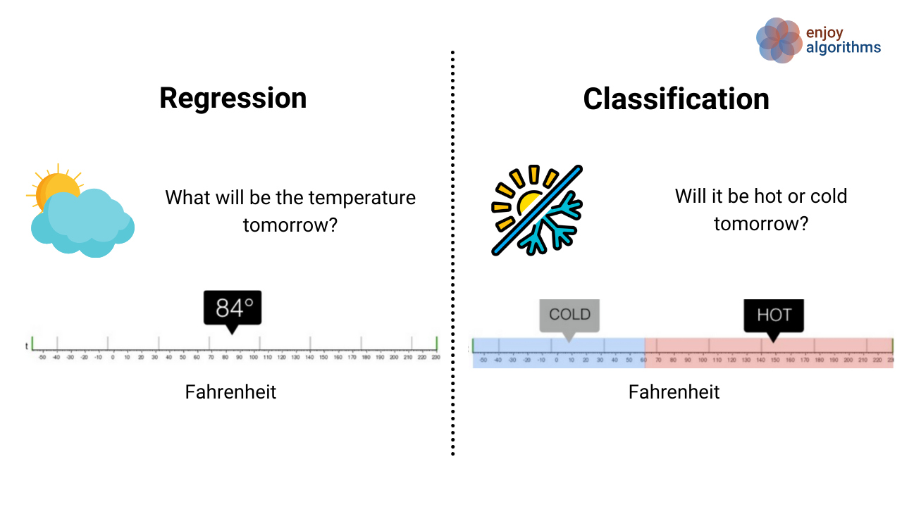

# Introduction to Machine Learning

Machine learning models can be broadly categorized into different categories based on their objectives and the types of tasks they are designed to solve. The categories outlined are not necessarily exclusive, and many machine learning models can have functionalities that span multiple categories. The categorization is more about the primary purpose or task that a model is designed for.

1. Making Decisions (Classifiers):
  - Purpose: Teach the computer to make choices or categorize things.
  - Examples:
    - Object classification: If you show it pictures of fruits, it can learn to distinguish between apples and oranges.
    - Speech Recognition: Recognize and transcribe spoken words.
    - Music Genre Classification: Classify music into different genres based on audio features.

2. Predicting Values (Regression):
  - Purpose: Teach the computer to predict continuous numbers based on input.
  - Examples:
    - If you give it data about houses, it can predict the price of a new house.
    - Pose Estimation: Track facial landmarks for applications like augmented reality.
    - Object Tracking: Follow the movement of specific objects in a video stream.
    - Action Recognition: Recognize and track human activities in video sequences.
    - Sound Pitch Detection: Determine the frequency or pitch of a sound.

3. Natural Language Processing (NLP):
  - Purpose: Understand and generate human language.
  - Examples:
    - Text Classification: Categorize text into predefined categories.
    - Named Entity Recognition: Identify entities (such as names, locations) in text.
    - Machine Translation: Translate text from one language to another.
    - Chatbots: Interact with users in natural language, understanding queries and generating responses.

4. Creating New Things (Generative Models):
   - Purpose: Teach the computer to generate new content that looks like what it learned.
   - Example: It can create new images or text that resemble the ones it was trained on.

 
<figure>
  
  <figcaption style="color:grey; font-style: italic;">Credit: enjoyalgorithms.com</figcaption>
</figure>
 
